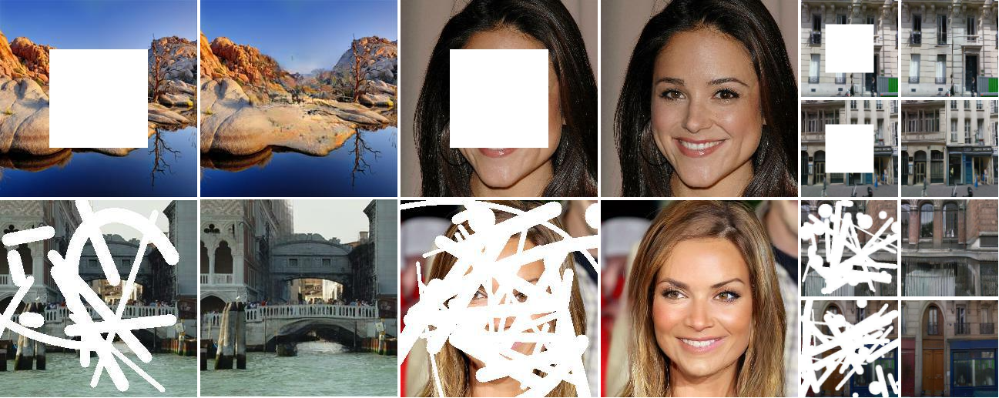
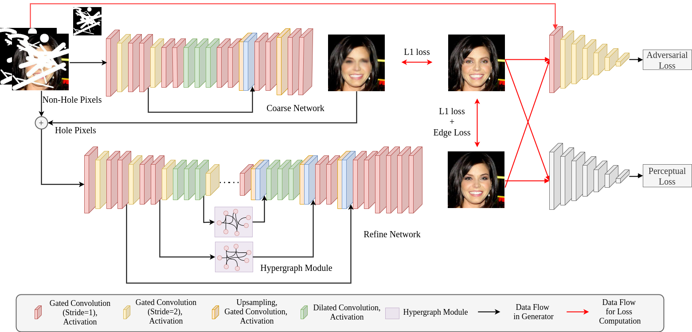
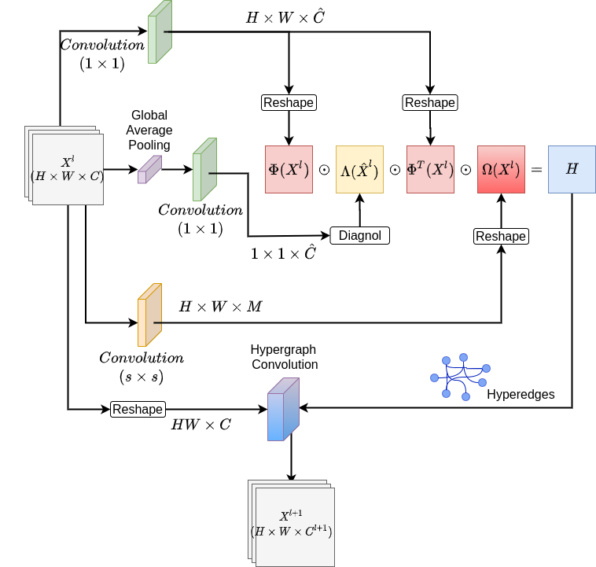

# Hyperrealistic Image Inpainting with Hypergraphs

This repository contains the implmentation Image Inpainting method proposed in the paper

Gourav Wadhwa, Abhinav Dhall, Subrahmanyam Murala, and Usman Tariq, Hyperrealistic Image Inpainting with Hypergraphs.In IEEE Winter Conference on Computer Vision (WACV), 2021.

[Paper](https://openaccess.thecvf.com/content/WACV2021/papers/Wadhwa_Hyperrealistic_Image_Inpainting_With_Hypergraphs_WACV_2021_paper.pdf) | [Supplementary Material](https://openaccess.thecvf.com/content/WACV2021/supplemental/Wadhwa_Hyperrealistic_Image_Inpainting_WACV_2021_supplemental.pdf) | [BibTex](#reference)




## Dependencies
* Python 3.5 or higher
* Tensorflow 2.x (tested on 2.0.0, 2.1.0, 2.2.0)
* Numpy
* Pillow
* Matplotlib
* tqdm
* OpenCV
* Scipy

## Our Framework

We use a two stage coarse-to-refine network for the task of image inpainting



## Hypergraph Layer


## Installation

```bash
git clone https://github.com/GouravWadhwa/Hypergraphs-Image-Inpainting.git
cd Hypergraphs-Image-Inpainting
```

## Testing
Download the pretrained models from the following links
* CelebA-HQ ([Center Mask](https://drive.google.com/drive/folders/1sS3umEYN-wK-srVwcyYUD_AcXbqBEPd-?usp=sharing), [Random Mask](https://drive.google.com/drive/folders/1_BHYB5f-VwdOAB1q2NutrzPGecjWQz1p?usp=sharing))
* Places2 ([Center Mask](https://drive.google.com/drive/folders/1T7uLBwXHRKJWUHVNACkYutvpAyDlbJdD?usp=sharing), [Random Mask](https://drive.google.com/drive/folders/1dk1zSm1FxZVaafOtvoud8aAdZ6Ubs4oU?usp=sharing))
* Paris Street View ([Center Mask](https://drive.google.com/drive/folders/1KHnXT-QmfDkpy2tgo3faBAt6it-9ZUsU?usp=sharing), [Random Mask](https://drive.google.com/drive/folders/1ecrjYXCL8FHnfZ-JMRVCUluuvvkuNGTK?usp=sharing))
* Facades Dataset ([Center Mask](https://drive.google.com/drive/folders/1kf5SacEoBpr9li4F7Wwnj2XiX_uQwhRr?usp=sharing), [Random Mask](https://drive.google.com/drive/folders/1uJWJjWn7RXEhVwUYZycnv4IZzUaHomAW?usp=sharing))

Put the checkpoints in the folder `pretrained_models/`. To test images in a folder, specify the path to the folder using `--test_dir` and specify the model to be loaded using `--checkpoint_prefix`.

For example (for CelebA-HQ dataset on Random Mask) :

```bash
python test.py --dataset celeba-hq --pretrained_model_dir pretrained_models/ --checkpoint_prefix celeba_hq_256x256_random_mask --random_mask 1 --test_dir [Testing Folder Path]
```

Note - For all predicted images, 1st image represent the input image, 2nd represent the ground truth, 3rd represents the coarse network output and the final image is our final prediction.

You can use `evaluate.py` to determine SSIM and PSNR of the predicted images.

## Training
You can train the Hyperrealistic image inpainting network using the following command

For CelebA-HQ dataset with irregular holes

```bash
python training.py  --random_mask 1 --train_dir [Training Folder Path] --batch_size [Batch Size]
```

where `[Training Folder Path]` indicates the path in which training images are stored, and `[Batch Size]` indicated the batch size used for training.

For center mask change the `-random mask` to `1`.

Instead of providing the training directory you can also make a file in which the path of all training images is stored (`--train_file_path [TRAIN FILE PATH]`)

Training results and the checkpoints will be stored in the Training directory created by running this code.

## Reference

If you find this work useful or gives you some insights, please cite:
```
@InProceedings{Wadhwa_2021_WACV,
    author={Wadhwa, Gourav and Dhall, Abhinav and Murala, Subrahmanyam and Tariq, Usman},
    title={Hyperrealistic Image Inpainting With Hypergraphs},
    booktitle={Proceedings of the IEEE/CVF Winter Conference on Applications of Computer Vision (WACV)},
    month={January},
    year={2021},
    pages={3912-3921}
}
```

## Contact
The code and associated models can only be used for research purposes in an academic setting. For any commercial usage and licensing, please contact 2017eeb1206@iitrpr.ac.in
