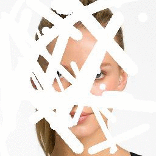

# Hyperrealistic Image Inpainting with Hypergraphs

This repository contains the implmentation Image Inpainting method proposed in the paper

Gourav Wadhwa, Abhinav Dhall, Subrahmanyam Murala, and Usman Tariq, Hyperrealistic Image Inpainting with Hypergraphs.In IEEE Winter Conference on Computer Vision (WACV), 2021.

[Paper](https://openaccess.thecvf.com/content/WACV2021/papers/Wadhwa_Hyperrealistic_Image_Inpainting_With_Hypergraphs_WACV_2021_paper.pdf) | [Supplementary Material](https://openaccess.thecvf.com/content/WACV2021/supplemental/Wadhwa_Hyperrealistic_Image_Inpainting_WACV_2021_supplemental.pdf) | [BibTex](#reference)




## Dependencies
* Python 3.5 or higher
* Tensorflow 2.x (tested on 2.0.0, 2.1.0, 2.2.0)
* Numpy
* Pillow
* Matplotlib
* tqdm
* OpenCV
* Scipy

## Our Framework

We use a two stage coarse-to-refine network for the task of image inpainting


## Hypergraph Layer 


## Installation

```bash
git clone https://github.com/GouravWadhwa/Hypergraphs-Image-Inpainting.git
cd Hypergraphs-Image-Inpainting
```

## Reference

If you find this work useful or gives you some insights, please cite:
```
@InProceedings{Wadhwa_2021_WACV,
    author={Wadhwa, Gourav and Dhall, Abhinav and Murala, Subrahmanyam and Tariq, Usman},
    title={Hyperrealistic Image Inpainting With Hypergraphs},
    booktitle={Proceedings of the IEEE/CVF Winter Conference on Applications of Computer Vision (WACV)},
    month={January},
    year={2021},
    pages={3912-3921}
}
```
## Contact

For any further queries please contact at 2017eeb1206@iitrpr.ac.in 
(The code is under development.)
